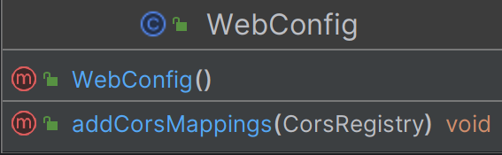
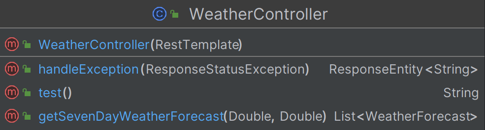
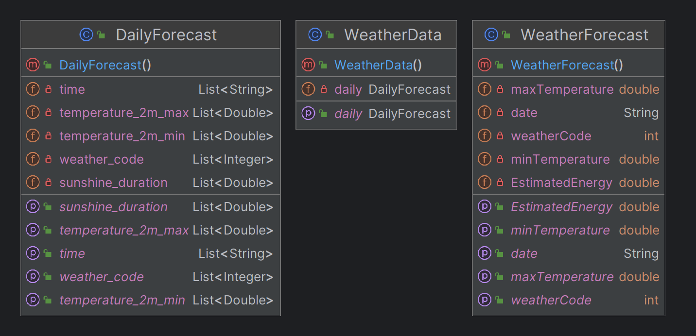
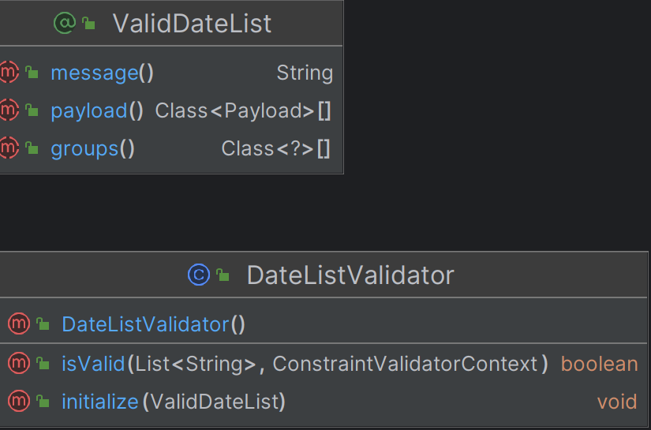
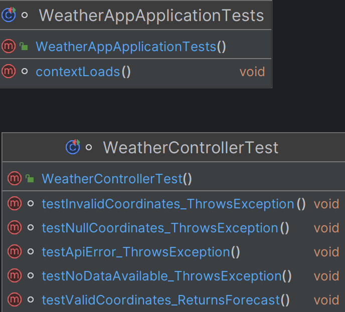

## Weather Forecast Backend 

### Project Description 
Backend of an application used for predicting the weather for the next 7 days.
Integrated with an external API  <a href = "https://open-meteo.com/">open-meteo</a>. <br/> 
<a href= "https://github.com/soberyoda/WeatherAppFrontend">FRONTEND REPOSITORY</a>

The created endpoint returns data in JSON format: Date, weather code, minimum and maximum temperature during the day, as well as the estimated value of generated energy.
#### Endpoint: 
```dff
/weather/forecast/${latitude}/${longitude}
```

### Sample usage
```dff
https://weatherapp-xi8f.onrender.com/weather/forecast/50.049683/19.944544
```

### Tech Stack 
<div>
    
    
	
	
    
    
    
</div>
<ul>
    <li>Java Oracle OpenJDK version 17.0.10</li>
    <li>Maven 3</li>
    <li>Lombok</li>
    <li>JUnit</li>
    <li>Mockito</li>
    <li>IntelliJ IDEA</li>
</ul>

### Documentation 
<details><summary><b>Configuration package</b></summary>
    
</details>
<details><summary><b>Controller Package</b></summary>
    
</details>
<details><summary><b>Model Package</b></summary>
    
</details>
<details><summary><b>Validation Package</b></summary>
    
</details>
<details><summary><b>Tests</b></summary>
    
</details>


